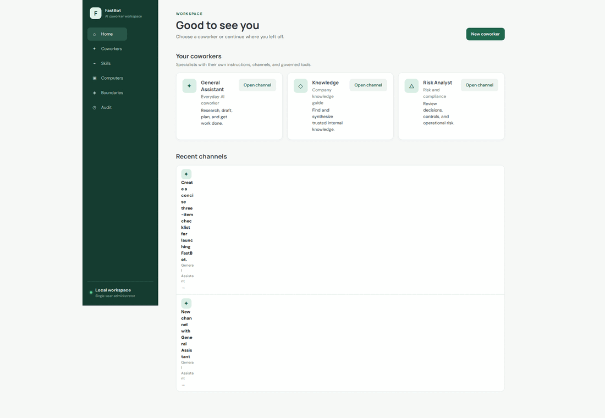

# FastBot

FastBot is a full-Python, server-rendered interpretation of
[CopilotKit OpenBot](https://github.com/CopilotKit/openbot): governed AI coworkers with durable
channels, visible activity, explicit policy, and an audit trail.

The application follows the FastHTML pattern used by the sister repositories. LangGraph is the
primary agent runtime, xAI Grok is the default model, and AG-UI is the protocol boundary. Text,
tools, state, errors, and generative UI stream from the server as SSE events—there is no React build.

## Platform demo



The walkthrough covers coworker channels, AG-UI streaming, LangGraph tool activity, generative UI,
governed browser execution, live computers, interactive human takeover, skills, policy boundaries,
MCP plugins, published components, and people/RBAC administration.

## Run locally

```bash
python3 -m venv .venv
.venv/bin/pip install -e '.[dev]'
cp .env.example .env
chmod +x scripts/dev.sh
scripts/dev.sh
```

The launcher uses `XAI_API_KEY` from the environment or inherits it from an ignored sister-repo
`.env` without printing or copying the secret. Open <http://127.0.0.1:5012>.

## Validate

```bash
.venv/bin/ruff check .
.venv/bin/pytest
```

The canonical endpoint is `POST /api/agui`; FastHTML chat uses the same runtime through
`POST /api/chat`.

## Included platform surfaces

- Local LangGraph/xAI and remote AG-UI coworkers with durable channels
- Canonical AG-UI server-side SSE, tool activity, state, interrupts, and generative UI
- Governed Playwright browser, workspace files, shell, live screens, and human takeover
- Separate Docker supervisor plus one resource-capped computer and volume per coworker
- Editable personal/deployment skills and per-coworker grants
- MCP server discovery, tool classification, and per-coworker grants
- Write-only encrypted credentials
- Published/withheld safe generative components
- People, administrator/member RBAC, policies, and complete audit history

For container deployment, set non-default `FASTBOT_SESSION_SECRET` and
`FASTBOT_SUPERVISOR_TOKEN`, then build both images and start the stack:

```bash
docker compose --profile build-only build
docker compose up -d fastbot supervisor
```

See [architecture](docs/architecture.md) for the complete protocol, security, and computer-runtime
design.

## Public landing

`web/landing.py` provides a FastHTML marketing landing (including Pricing: BYOC free / Host with us €1/month). Wire `landing_page` to the public `/` route once the app shell exists.
