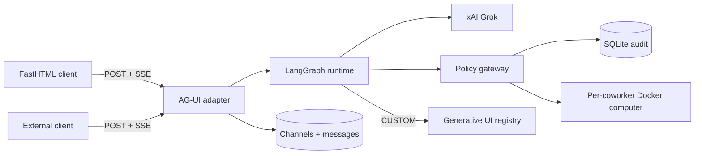

# FastBot architecture

FastBot is a server-rendered Python port of OpenBot's governed coworker model. FastHTML owns the
product and protocol routes; a separate supervisor owns the Docker socket; every coworker computer
has its own Chromium profile and named workspace volume.

## AG-UI contract

`POST /api/agui` accepts the run envelope and reads `forwardedProps.channelId` to resolve the
server-owned coworker. It streams canonical lifecycle, message, tool, state, and custom events.
Generative UI never embeds model-provided executable HTML: a `CUSTOM` event selects a known
component and supplies JSON props.

## Security model

- Deny rules are evaluated before allow rules; unmatched actions fail closed.
- Keys come from process environment and are never stored or sent to the browser.
- The development launcher can inherit a key from a sibling repo's ignored `.env` without printing
  or copying it.
- The application never holds the Docker socket. A token-protected supervisor creates capped,
  capability-dropped computer containers on a private control network plus an egress network.
- Coworkers have distinct named workspace volumes and persistent Chromium profiles. Browser,
  file, and shell calls reach the container only after the application gateway records an allow.
- Browser targets are DNS-resolved and private, loopback, link-local, and cloud-metadata addresses
  are refused independently of configurable policy.
- Human takeover is server-owned state. While a person controls a computer, agent browser and
  shell actions are refused; the person can click the live screen, type, and press keys;
  help/take/release and human-action transitions are audited.
- Runs, tool lifecycles, and policy decisions are audited.

## Product capabilities

- Local LangGraph coworkers and remote AG-UI coworkers use the same durable channel surface.
- AG-UI streams text, tools, state snapshots, errors, safe generative components, and human-help
  interrupts over server-side SSE.
- Skills are editable reusable instructions granted per coworker. They never grant a tool.
- MCP servers can be registered, introspected with `tools/list`, classified, and granted per
  coworker. Unclassified tools default to write risk.
- Credentials are write-only and Fernet-encrypted at rest. Agent and connector authorization
  references credential ids; secret values are never listed.
- Published components select one of the audited browser renderers (`checklist`, `notice`,
  `metric`, `table`). Components may be withheld per coworker; model-provided executable HTML is
  never evaluated.
- Single-user administration is the local default. Disabling it enables password sessions,
  administrator/member RBAC, user provisioning, and runtime role changes.

## Computer deployment flow

1. The application asks the supervisor to start a validated coworker slug.
2. The supervisor creates `fastbot-workspace-<slug>`, launches a resource-capped computer container,
   and returns only its private control-network address.
3. The application calls the computer with a separate bearer token. The computer exposes browser
   navigation/snapshot/screenshot and workspace read/write/shell operations.
4. The browser receives a multipart live screenshot stream. All capability calls continue through
   the application policy gateway; the computer service is not published to the host.
