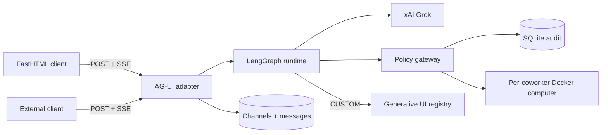

# FastBot architecture

FastBot is a server-rendered Python port of OpenBot's governed coworker model. The first milestone
uses one FastHTML process and SQLite while keeping protocol and computer boundaries explicit.

## AG-UI contract

`POST /api/agui` accepts the run envelope and reads `forwardedProps.channelId` to resolve the
server-owned coworker. It streams canonical lifecycle, message, tool, state, and custom events.
Generative UI never embeds model-provided executable HTML: a `CUSTOM` event selects a known
component and supplies JSON props.

## Security model

- Deny rules are evaluated before allow rules; unmatched actions fail closed.
- Keys come from process environment and are never stored or sent to the browser.
- The development launcher can inherit a key from a sibling repo's ignored `.env` without printing
  or copying it.
- Coworkers have distinct workspace paths and a Docker runtime abstraction.
- Runs, tool lifecycles, and policy decisions are audited.

## Parity roadmap

1. Current: coworkers, channels, LangGraph/xAI, AG-UI SSE, generative UI, durable history, policy,
   audit, skills/computer scaffolding, and single-user administration.
2. Next: Docker Chromium service, screenshot streaming, governed browser/files/shell tools,
   interrupts, and human takeover.
3. Then: encrypted credentials, MCP grants, remote AG-UI coworkers, editable skills, component
   publishing, identities, and RBAC.
